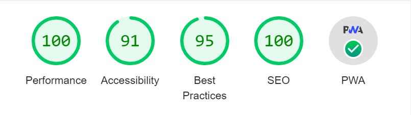

# Selfie - DHNLR

Camera application to appreciate yourself as work of art

## Demo

Visit [Selfie](https://selfie-five.vercel.app/)

## Features

- Take picture
- Apply filter (blur, sepia, and grayscale)

## Lighthouse



## Requirements (recommended)

- node: `latest` or `lts`

**Install Node.js**: Our app is powered by [Node.js](https://nodejs.org/en/). We recommend you to install Node.js using [nvm](https://github.com/nvm-sh/nvm).

## Running the service locally

1. Run these command to start the project

```bash
$ npm i        # install all the deps (first time only, if there's no dep update)
$ npm run dev  # start the service on local
```

2. Open `localhost:5173` or `location shown on terminal` on your default browser and login to access the full website capability

## Supported Library

- react
- jest
- vite
- react-measure
